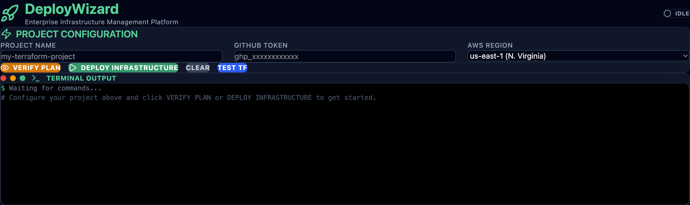

# DeployWizard 🚀

A small **desktop GUI (Electron + React)** that provisions a GitHub repository
through **Terraform** — Infrastructure-as-Code, without touching the terminal.

You enter a project name and a GitHub token in the app; DeployWizard runs a
Terraform plan/apply behind the scenes and creates an initialized public repo
for you.

> A focused demo of wrapping an IaC workflow (Terraform) inside a cross‑platform
> desktop app. Not an enterprise product — a clean, self-contained portfolio
> piece.

## Screenshot



<!-- Drop a PNG of the running app at docs/screenshot.png and it will show here. -->

## Stack

- **React 19** + **Vite 7** + **Tailwind CSS 4** — UI
- **Electron 39** — desktop shell (macOS / Windows / Linux)
- **Terraform** (`integrations/github` provider) — provisioning engine

## How it works

```
React UI  ──>  Electron main (IPC)  ──>  terraform plan / apply  ──>  GitHub repo
```

The Terraform definition lives in `terraform-workspace/main.tf`. The GitHub
token is passed at runtime as a `sensitive` Terraform variable
(`TF_VAR_github_token`) — it is **never** written to disk or committed.

## Run in development

```bash
npm install
npm run dev          # Vite + Electron with hot reload
```

You'll need [Terraform](https://developer.hashicorp.com/terraform/install)
installed and on your `PATH`, plus a GitHub token with `repo` scope.

## Build a desktop app

```bash
npm run dist:mac     # or dist:win / dist:linux
```

Output goes to `release/`.

## Security notes

- The GitHub token is entered at runtime and handled as a Terraform `sensitive`
  variable. Do not hardcode it.
- `*.tfstate`, `*.tfvars` and `.terraform/` are git-ignored — Terraform state
  can capture secrets in plaintext and must never be pushed.

## License

[MIT](./LICENSE)
